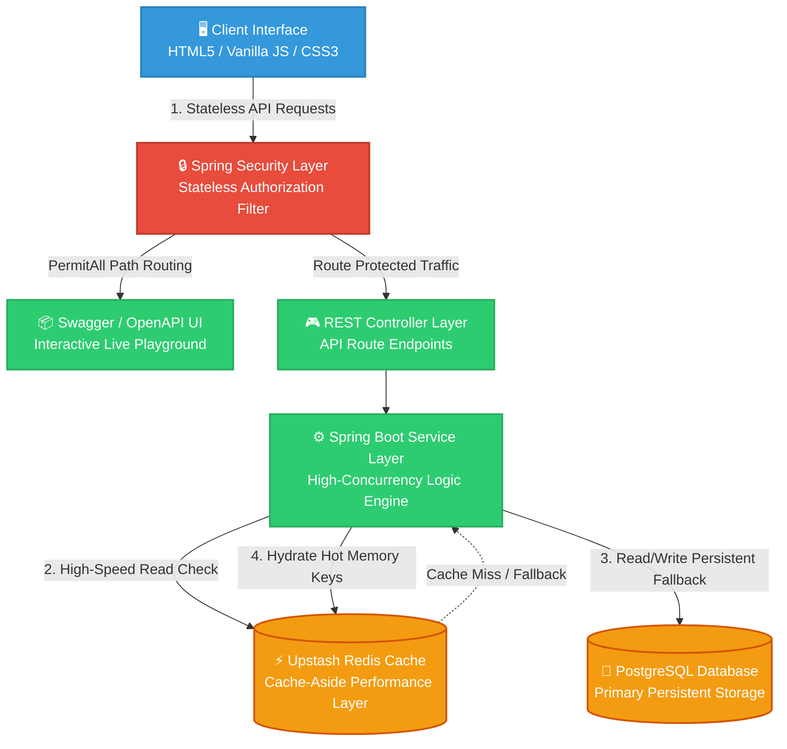

```markdown
# 🚀 ScaleStore — High-Concurrency E-Commerce Backend


Professional-grade scalable backend system built using Spring Boot 3, PostgreSQL, Redis, Docker, and Spring Security 6.

Designed to simulate real-world high-traffic e-commerce systems with secure authentication, distributed caching, and concurrency-safe transactional workflows.

---

## 🔥 Core Features

- Stateless JWT Authentication
- Role-Based Authorization
- Redis Distributed Caching
- Concurrency-Safe Checkout System
- Global Exception Handling
- Dockerized Deployment
- RESTful API Architecture
- PostgreSQL Persistence
- Secure Password Encryption using BCrypt
- Automated CI/CD Build Pipeline Verification

---

## 🛠️ Tech Stack

### Backend
- Java 17
- Spring Boot 3
- Spring Security 6
- Spring Data JPA
- Hibernate ORM
- Springdoc OpenAPI / Swagger UI

### Database & Caching
- PostgreSQL (Production on Render)
- H2 Embedded Database (Isolated Local Profile Environment)
- Redis Cloud (Upstash Redis)

### DevOps & Deployment
- Docker
- Render Cloud Platform
- GitHub Actions (Automated CI Run Runner)
- Maven

### Frontend
- HTML5
- CSS3
- Vanilla JavaScript

---

## ⚡ System Architecture & Visual Proof

### 📊 Automated System Data Flows


### 🖼️ Operational Dashboards

#### 🌐 Interactive Endpoint API Playground (Swagger UI)

#### 🛒 Frontend ScaleStore Product Shelf Dashboard

---

## 🔐 Authentication Flow

* JWT token generated after successful login
* Custom `JwtFilter` validates every protected request
* Stateless session management
* Secure password encryption using BCrypt

---

## ⚡ Redis Distributed Caching

Integrated Redis distributed caching using:

* `@Cacheable`
* `@CacheEvict`

### Benefits

* Reduced repeated database reads
* Faster product catalog responses
* Improved scalability under heavy traffic
* Lower backend response latency

---

## 🔄 Concurrency Control

Implemented pessimistic locking to prevent:

* Race conditions
* Duplicate purchases
* Overselling inventory

Uses:

```java
@Lock(LockModeType.PESSIMISTIC_WRITE)

```

This ensures transactional consistency during concurrent checkout operations.

---

## 🌍 Deployment

Deployed on Render with:

* Environment variable management
* PostgreSQL integration
* Production monitoring
* Cloud-hosted backend services
* Dockerized deployment consistency

---

## 📡 API Endpoints

| Method | Endpoint | Description |
| --- | --- | --- |
| POST | `/api/auth/signup` | Register User |
| POST | `/api/auth/login` | Generate JWT |
| GET | `/api/products` | Fetch Products |
| GET | `/swagger-ui/index.html` | Interactive Documentation API Interface |
| POST | `/api/products/{id}/purchase` | Purchase Product |

---

## 🐳 Run Using Docker

```bash
docker-compose up --build

```

---

## 🚀 Local Setup

```bash
git clone <your-repository-url>
cd ScaleStore
mvn spring-boot:run

```

---

## 📈 Future Improvements

* API Rate Limiting
* Kafka Event Streaming
* Integration Testing Framework Implementation
* Monitoring & Logging Metrics Dashboards (Prometheus/Grafana)

---

## 👨‍💻 Author

**Kalevaru Charan Ganesh** Backend-focused Java Developer

B.Tech CSE — B. V. Raju Institute of Technology, Narsapur

```

```
