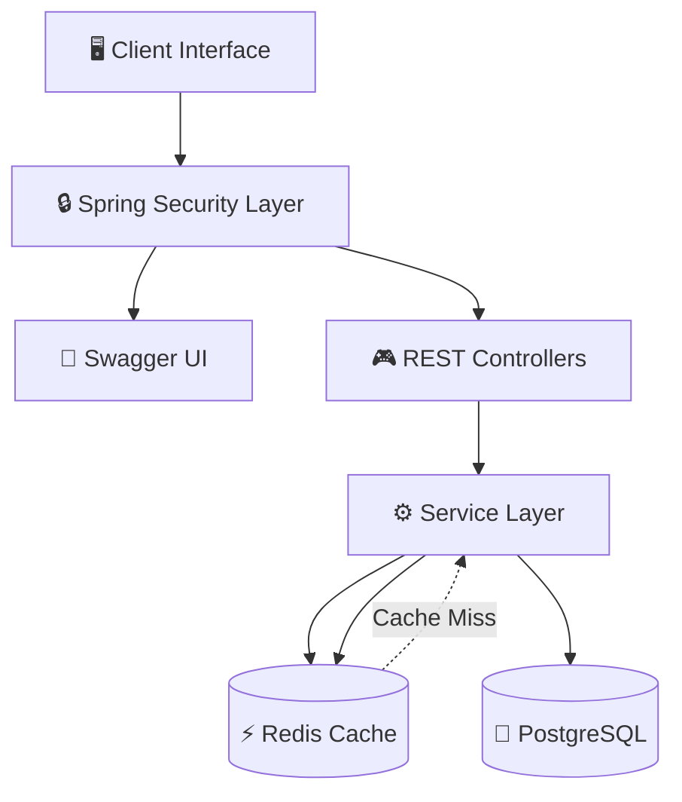

# 🚀 ScaleStore — High-Concurrency E-Commerce Backend


Professional-grade scalable backend system built using Spring Boot 3, PostgreSQL, Redis, Docker, and Spring Security 6.

Designed to simulate real-world high-traffic e-commerce systems with secure authentication, distributed caching, and concurrency-safe transactional workflows.

---

## 🔥 Core Features

- Stateless JWT Authentication
- Role-Based Authorization
- Redis Distributed Caching
- Concurrency-Safe Checkout System
- Global Exception Handling
- Dockerized Deployment
- RESTful API Architecture
- PostgreSQL Persistence
- Secure Password Encryption using BCrypt
- Automated CI/CD Build Verification using GitHub Actions
- Interactive API Documentation using Swagger/OpenAPI

---

## 🛠️ Tech Stack

### Backend
- Java 17
- Spring Boot 3
- Spring Security 6
- Spring Data JPA
- Hibernate ORM
- Springdoc OpenAPI / Swagger UI

### Database & Caching
- PostgreSQL (Production Database)
- H2 Embedded Database (Development Environment)
- Redis Cloud (Upstash Redis)

### DevOps & Deployment
- Docker
- Render Cloud Platform
- GitHub Actions
- Maven

### Frontend
- HTML5
- CSS3
- Vanilla JavaScript

---

## ⚡ System Architecture



---

## 🖼️ Application Preview

### 🌐 Swagger/OpenAPI Documentation UI

Interactive API testing and endpoint documentation available through Swagger UI.

### 🛒 ScaleStore Dashboard

Responsive frontend dashboard integrated with backend REST APIs.

---

## 🔐 Authentication Flow

- JWT token generated after successful login
- Custom `JwtFilter` validates protected requests
- Stateless session management
- BCrypt password encryption

---

## ⚡ Redis Distributed Caching

Integrated Redis distributed caching using:

- `@Cacheable`
- `@CacheEvict`

### Benefits

- Reduced repeated database reads
- Faster product catalog responses
- Improved scalability under heavy traffic
- Lower backend response latency

---

## 🔄 Concurrency Control

Implemented pessimistic locking to prevent:

- Race conditions
- Duplicate purchases
- Overselling inventory

Uses:

```java
@Lock(LockModeType.PESSIMISTIC_WRITE)
```

This ensures transactional consistency during concurrent checkout operations.

---

## 🌍 Deployment

Deployed on Render with:

- Environment variable management
- PostgreSQL integration
- Production monitoring
- Cloud-hosted backend services
- Dockerized deployment consistency

---

## 📘 API Documentation

Swagger UI available at:

```txt
http://localhost:8080/swagger-ui/index.html
```

---

## 📡 API Endpoints

| Method | Endpoint | Description |
|--------|----------|-------------|
| POST | `/api/auth/signup` | Register User |
| POST | `/api/auth/login` | Generate JWT |
| GET | `/api/products` | Fetch Products |
| POST | `/api/products/{id}/purchase` | Purchase Product |
| GET | `/swagger-ui/index.html` | Swagger UI Documentation |

---

## 🐳 Run Using Docker

```bash
docker-compose up --build
```

---

## 🚀 Local Setup

```bash
git clone <your-repository-url>
cd ScaleStore
mvn spring-boot:run
```

---

## 📈 Future Improvements

- API Rate Limiting
- Kafka Event Streaming
- CI/CD Pipeline Enhancements
- Monitoring & Logging using Prometheus/Grafana
- Unit Testing & Integration Testing
- Microservices Architecture Migration

---

## 👨‍💻 Author

**Kalevaru Charan Ganesh**  
Backend-focused Java Developer

B.Tech CSE — B. V. Raju Institute of Technology, Narsapur
